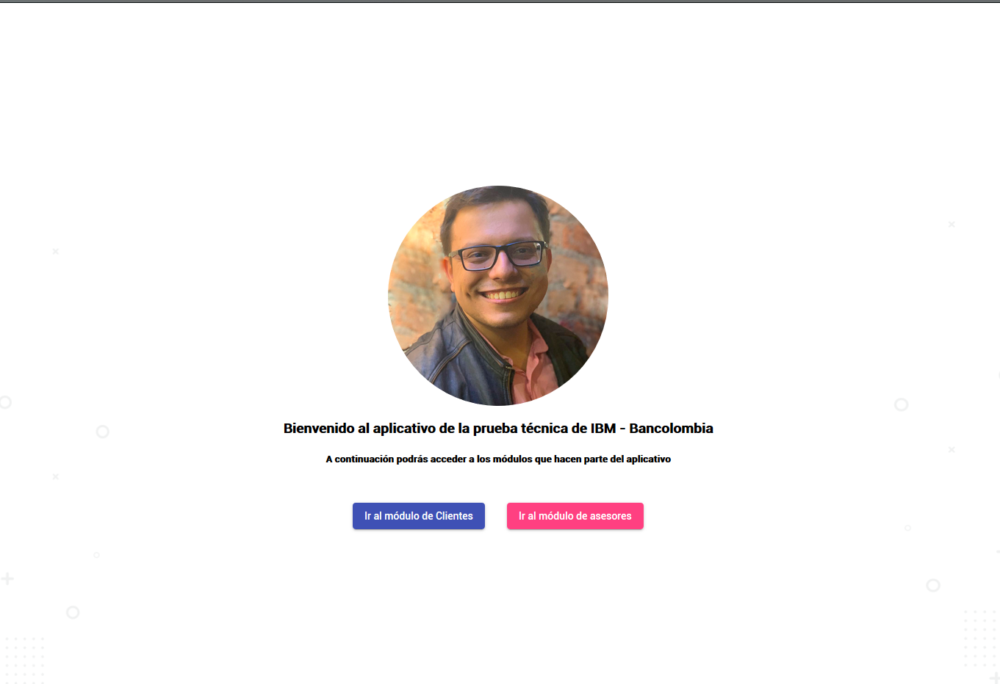
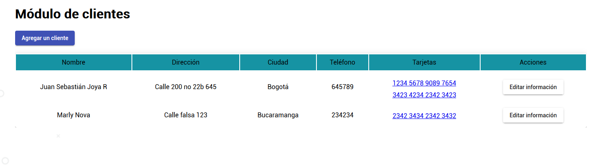
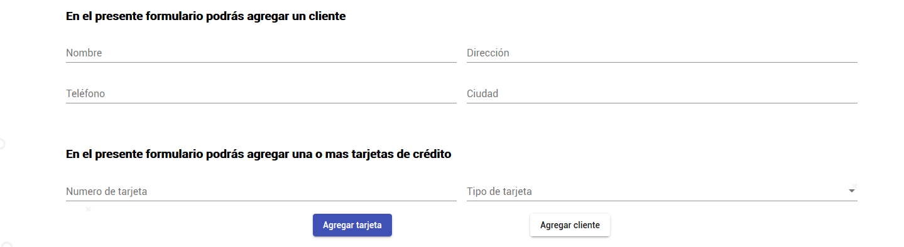
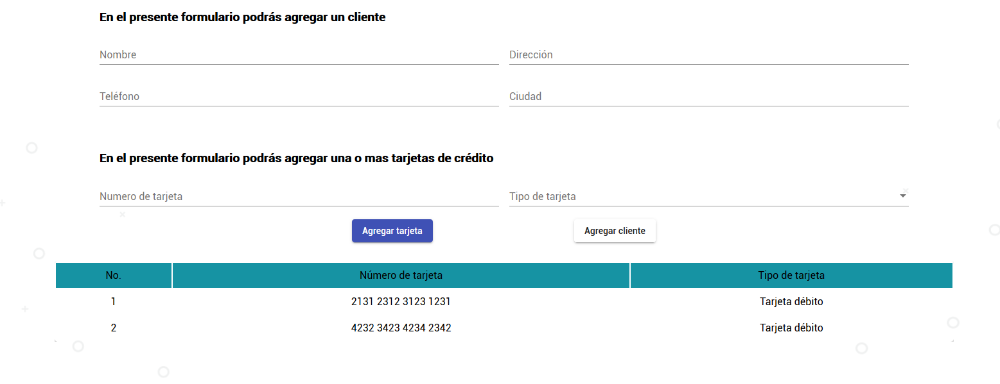

## Aplicativo para aplicar para el cargo de Desarrollador Front-End IBM-Bancolombia

El presente deocumento tiene como proposito enseñar las ocnsideraciones técnicas y el uso del aplicativo diseñado para aplicar para el cargo de desarollador Front-End

## Aplicativo en funcionamiento

En el siguiente enlace se podrá ver el despliegue del aplicativo

**<a href="http://aplicacionibm.sebasjoya.com">Aplicativo apliación IBM - Bancolombia</a>**

## Consideraciones técnicas

A continuación se comentarán las ocnsideraciones técnicas para el desarrollo del presente aplicativo

- La programación del Front- End se realizó en Angular 8. Los archivos fuente utilizados se pueden encontrar en la carpeta src
- La API de manejo de datos se realizó en PHP.
- La Base de datos se realizó en SQLite 3, por lo que no funciona bajo un motor de Bases de datos, sino que es un archivo que se edita     mediatne un controlador que trae PHP. Una copia del modelo de la base de datos se puede encontrar ne la carpeta api/bd/ de presente      repositorio

## Uso de la aplicación

Al momento de ingresar a la aplicación, aparece la siguiente pantalla de bienvenida, que permite ir al módulo de lcientes o al módulo de asesores.

### Módulo de clientes

El módulo de clientes presenta la información de los clientes, y sus tarjetas.

#### Agregar un cliente

Para agregar un cliente, se debe oprimir el botón [Agregar un cliente], en el modulo clientes.

En la sección de agregar clientes se debe agregar la información del cliente y la cantidad de tarjetas que este posea, las cuales se mostrarán en una tabla en la medida en que se vayan insertando.

#### Modificar un cliente

#### Ver consumos de una tarjeta

Los consumos están asociados a una tarjeta. Para ver los consumos, se oprime sobre el numero de la tarjeta por consultar.

#### Agregar un consumo a una tarjeta

Para agregar un consumo a una tarjeta, se debe oprimir el botón Agregar Consumo en la sección de ocsnumos, el cual desplegará el formulario que le permite a la persona agregar la información.

### Módulo de asesores

El módulo de asesres se puede acceder desde el menú principal, oprimiendo el botón Asesores

#### Agregar un asesor

#### Modificar un asesor
